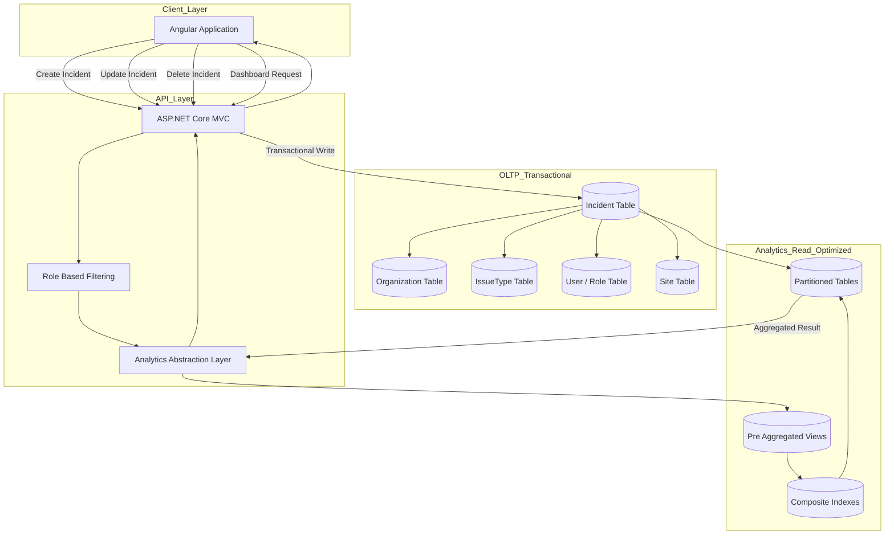

# Incident Data Platform
### Multi-Tenant Operational Analytics Architecture on AWS

This project represents the data platform layer of a cloud-based Incident Management System.

The platform ingests real-time operational incident data, models it in a multi-tenant relational architecture, and exposes structured analytics through optimized database views and API abstraction layers.

I contributed to the overall system architecture and independently designed and implemented the **end-to-end analytics data pipeline and dashboard layer**.

---

# 🎯 Platform Mission

Transform operational incident events into:

- Structured analytical datasets
- Aggregated multi-dimensional metrics
- Spatial intelligence views
- Role-aware analytical endpoints

The system supports real-time reporting while maintaining scalable analytical performance.

---

# 🏗 Data Platform Architecture

```
Operational Writes (ASP.NET Core)
        ↓
AWS RDS MySQL (OLTP Schema)
        ↓
Analytics Views (Pre-Aggregated Layer)
        ↓
ASP.NET Core REST Abstraction
        ↓
Angular Analytics Dashboard
```

This architecture separates:

- Transactional workload (OLTP)
- Aggregation workload (Analytics Views)
- Presentation layer (Dashboard)

## Diagram



---

# 🧩 Data Modeling Strategy

## Multi-Tenant Isolation

All core entities include:

- orgId partitioning
- Role-based visibility control
- Secure row-level filtering

Enables SaaS-style data separation.

---

## Core Entities

- Organization
- User / Role / UserType
- Incident (Operational fact table)
- IssueType (Hierarchical dimension)
- Site (Geographical dimension)
- Status (Lifecycle state)

Incident acts as the central fact entity.

---

# 📊 Analytics Layer (My Ownership)

I designed the analytics abstraction layer directly on top of the OLTP schema.

## 1️⃣ Analytical View Design

Created optimized MySQL Views for:

- Incident count by time dimension
- Incident count by IssueType hierarchy
- Site-level aggregation
- Reporter-based aggregation
- Risk/Threat segmentation
- Status lifecycle metrics
- Monthly / quarterly trend analysis

Design principles:

- Pre-aggregated GROUP BY
- Indexed date filtering
- Conditional aggregation
- orgId-based partition filtering
- Reduced API computation overhead

---

## 2️⃣ Query Optimization Strategy

- Minimized expensive joins at API layer
- Used indexed timestamp columns
- Structured views to avoid repeated aggregation
- Reduced N+1 API queries
- Ensured low-latency dashboard rendering

---

## 3️⃣ Spatial Data Modeling

Integrated site-based aggregation for:

- Geographic clustering
- Top affected site metrics
- Incident density visualization

Converted operational location data into spatial intelligence views.

---

# 🔐 Data Governance & Access Control

The analytics layer respects:

- Organization-level isolation
- Role-based data exposure
- Sensitive issue filtering
- Reporter-level visibility constraints

Data filtering is enforced at the query level, not only UI.

---

# 🚀 Engineering Highlights

- Multi-tenant SaaS data architecture
- Hierarchical dimension modeling (IssueType tree)
- Fact + dimension-style schema
- OLTP → Analytics abstraction design
- Database-driven aggregation strategy
- View-based analytical optimization
- Spatial analytics integration
- End-to-end data ownership

---

# 📈 Platform Impact

The data platform enables organizations to:

- Monitor incident trends in real time
- Identify high-risk locations
- Analyze severity distribution
- Evaluate operational workload
- Support data-driven response decisions

This project demonstrates practical experience in:

- Designing scalable relational data models
- Building analytics abstraction layers on OLTP systems
- Implementing multi-dimensional aggregation strategies
- Delivering production-grade operational analytics
